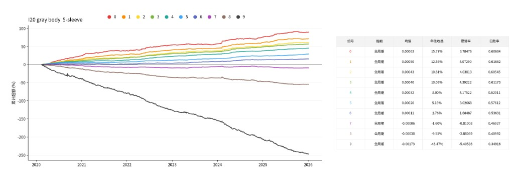

# 灰度 K 线图像回归（I20 / I60）

用日频灰度蜡烛图预测未来 5 个交易日相对 688 平权的超额收益，再按预测超额做每日选股和 5 个组合的回测。

这一支是灰度实体版。`main` 仍是上一版 RGB 回归，读的是已经生成好的 3 通道图。这一支要重新画图：三列实心实体保留，涨跌、影线、成交量和 MACD 用不同灰度分开，MACD 用窗口之前的收盘预热。

## 图像

图像、权重和预测都在：

```text
/storage/server/144server/cq/ChenSiwei/k_pictures_gray_body/{I20|I60}/
```

不要覆盖 `k_pictures_rgb_I20` 和 `k_pictures_gray_reg`。

每个窗口目录里有：

| 文件 | 内容 |
|---|---|
| `images.npy` | `uint8`，形状 `(N, 1, H, W)`，NCHW |
| `labels.parquet` | 与图像行对齐的标签 |
| `image_spec.json` | 高度、宽度、通道和面板行数 |

`I20` 是 20 根日 K，宽 60，形状 `(N, 1, 100, 60)`。`I60` 是 60 根日 K，宽 180，形状 `(N, 1, 100, 180)`。高度固定 100，不缩放，不使用 JPEG。每根 K 线占 3 列像素。

画面分三块，背景为黑。灰度值：

- 上面 70 行是价格。收盘高于开盘的实体为 255，收盘低于或等于开盘的实体为 96。开盘到收盘的实体涂满这 3 列。最低到最高的影线只画在中间列，灰度为 176。没有均线。
- 中间 15 行是成交量，只画中间列。阳线对应 220，阴线对应 48，和实体的灰度不同。
- 下面 15 行是 MACD。EMA 12/26，信号线 9。计算时带上窗口之前最多 105 根收盘做预热，只把窗口内这一段画出来。DIF 为 200，只落在每根 K 线的左列。DEA 为 140，只落在右列。柱画在中间列，大于等于 0 为 255，小于 0 为 64。顶点不连成横穿其他列的线，避免盖住柱。DIF、DEA 和柱一起按窗口内最大绝对值缩放到这 15 行里。

价格先把窗口第一根收盘当作锚，在收益率路径上重建 OHLC，再用窗口内 OHLC 的最小最大值归一化。MACD 用同一条收益率路径，锚点收盘为 1。样本是每个交易日一张图。

生成在 `03_generate_images.ipynb`。`WINDOW_KEY` 用 `20` 或 `60`。调试时 `MAX_CODES = 20`，全量改为 `None`。

## 标签与样本过滤

`labels.parquet` 的列：

| 列 | 含义 |
|---|---|
| `code`、`date` | 股票和调仓日 t |
| `stock_ret` | t 之后 5 个交易日的个股收益，`prod(1+r)-1` |
| `mkt_ret` | 同期 688 平权的 5 日收益。日收益来自 `pingquan.csv` 的 `688` 列，单位由百分数换成小数 |
| `future_ret` | `stock_ret - mkt_ret`，回归的目标 |
| `label` | `future_ret > 0` 为 1，否则为 0。本仓库训练时不使用这一列 |
| `split` | `train`、`valid`、`test` 或 `ignore` |

过滤与 `no_rolling` 相同，在生成图像时完成：

- 只保留 `universe.parquet` 里 `eligible` 的股票。
- 窗口在 t 之前必须凑满，t 之后必须还有 5 个交易日。
- 上市缓冲 1 根：窗口起点不能落在该股票行情的第一根上。
- 调仓日 t 涨停或跌停的样本去掉。窗口内部的涨跌停保留，也不要求 t+1 非涨停。
- 从窗口第一天到 t+5，只要有一天 ST，整段去掉。
- 这段日期在全市场日历上的跨度大于 `窗口 + 5` 时，视为中间有停牌，去掉。
- 窗口内成交量，以及 t+1 到 t+5 的个股收益和 688 收益，都必须是有限数。

划分按时间，训练和验证之间、验证和测试之间各空出 `窗口` 个交易日，避免同一段 K 线同时出现在两个集合里：

- 2015-01-01 到 2019-12-31 为训练加验证，按日期取前 70% 做训练。
- 空出窗口长度后再做验证。
- 再空出同样长度，并且不早于 2020-01-01，直到 2025-12-31 为测试。
- 落在两段空档里的样本标记为 `ignore`。图像仍在 `images.npy` 里，训练和预测都不读它们。

行情面板在 `/home/shixi05/ChenSiwei/0914/data/processed`。688 平权在 `/storage/server/227server/marketdata/pingquan/daily/pingquan.csv`。

## 模型

卷积几何与 `no_rolling` 相同，输入通道为 1。每一块是无偏置卷积、BatchNorm、LeakyReLU（负斜率 0.01）、MaxPool。

| | I20 | I60 |
|---|---|---|
| 输入 | `(1, 100, 60)` | `(1, 100, 180)` |
| 卷积核 / 步长 / padding | `(5, 3)` / `(3, 1)` / `(12, 1)` | 相同 |
| 池化核 / 步长 | `(2, 1)` / `(2, 1)` | 相同 |
| 通道 | 64, 128, 256 | 64, 128, 256, 512 |

卷积之后展平，Dropout 0.5，线性层输出 1 个数。权重用 Xavier uniform 初始化。

损失用的目标先按训练集 1% 和 99% 分位截尾，再用截尾后的均值和标准差做标准化。预测时乘回这个标准差并加回均值。日志里的 mse 是截尾后超额尺度上的均方误差。

## 训练

在 `04_train_predict.ipynb` 里运行。优化器是 Adam，学习率固定 `1e-5`，没有学习率衰减，也没有早停。每个种子固定 10 个 epoch。留下的是验证集 Spearman 最高的那一轮：预测值和未截尾的 `future_ret` 的排序相关性。不一定是第 10 轮，也不按验证集 mse 选择。

训练集使用全部 `split == train` 的样本，不做类别下采样。像素均值和标准差在训练索引上抽 2 万张图估计，是一个标量。笔记本里 I20 的 batch 是 64，I60 是 32；`num_workers=0`，`pin_memory=False`。图像在网络盘上随机读取，多进程和锁页内存帮不上忙。

每个 epoch 打印训练和验证的 mse、方向正确率 `dir`，以及验证集 `ic`。方向正确率是预测超额大于 0 是否和真实超额同号，只作记录。`ic` 决定留哪一轮。

随机种子从 `20260417` 起。`N_SEEDS=1` 先试通，正式结果把笔记本里的 `N_SEEDS` 改成 5，预测时对各种子的超额取平均。已有最终的 `seed_k.pt` 会跳过。每个 epoch 会写 `seed_k.running.pt`，里面是到当时为止 Spearman 最高的权重。训练不能从 `running.pt` 接着跑，中断后这个种子会从头开始。

权重目录：

```text
/storage/server/144server/cq/ChenSiwei/k_pictures_gray_body/models/{I20|I60}/
```

## 预测与回测

`predict_window` 只对 `test` 做推理，写出

```text
/storage/server/144server/cq/ChenSiwei/k_pictures_gray_body/results/pred_{I20|I60}.parquet
```

`pred` 是预测的 5 日超额，可以是负数。它和二分类版本的 `prob` 不是同一个量。`prob` 是“超额大于 0”的概率，范围在 0 到 1。两边选股时都是当天分数从高到低取前 10%。

样本外还会打印 mse、方向正确率和 `pred` 与 `future_ret` 的相关系数。

`05_plot_top10.ipynb` 的回测与 `no_rolling` 的 5 个组合相同：

- 每个交易日按 `pred` 取最高 10%，等权。
- t 收盘买入，t+5 收盘卖出。资金分成 5 批，卖出所得再投入当天的新篮子，各批净值独立复利。
- 组合超额是当天各批超额相对 688 平权的净值加权平均。不满 5 批的日期不计入。
- 十分位、随机 10 组使用同一套盯市。
- 成本图按每边 5 个基点，在换仓时按单边换手的两倍扣除。十分位图本身不扣费。

## 如何运行

把本仓库的这一支放到服务器上单独一个目录。用该目录下的 Jupyter 内核从第一格按顺序跑。

1. `03_generate_images.ipynb`：先 `MAX_CODES = 20` 看校验是否通过，再改成 `None` 生成全量。图写到 `k_pictures_gray_body`。
2. `04_train_predict.ipynb`：确认第一格打印 `task = regression`，并且 `output` 指向 `k_pictures_gray_body`。训练后再跑预测。日志里应出现 `OOS mse=... dir_acc=... ic=...`，以及 `wrote .../pred_I20.parquet`。
3. `05_plot_top10.ipynb`：Top 10%、十分位、随机分组、扣费对照。

`WINDOW_KEY` 用 `"I20"` 或 `"I60"`，必须和已经生成的图一致。不要和正在读同一份 `images.npy` 的另一个训练同时跑，两边会抢网络盘。

主机内存约 62 GB，放不下整份 `images.npy`。训练使用内存映射，不要把整个数组读进内存。

## 仓库里没有的文件

`.gitignore` 排除了图像、权重、预测和日志。这些文件留在 144 和服务器本机目录里：

```text
*.npy  *.pt  *.parquet
data/  models/  results/  figures/  logs/
```

## I20 十分位

1 个种子，2020–2025，5 个组合，扣费前。组别 0 是预测超额最高的 10%。



## I60 十分位


