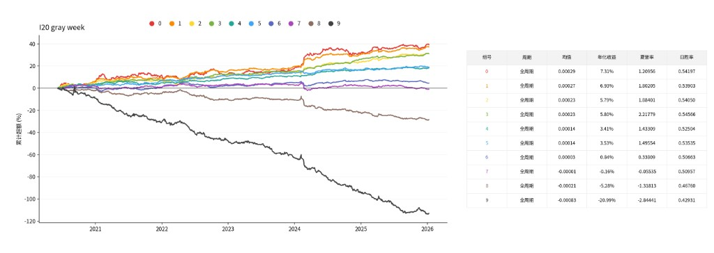

# 周 K 灰度图回归（gray-week）

这一支从 `gray-body` 拉出。灰度、网络和损失沿用日频那一版，改的是 K 线频率和调仓日。

日频 `gray-body` 仍在它自己的分支上，图在 `k_pictures_gray_body`。这一支重新画图，写到 `k_pictures_gray_week`，不要覆盖那一份。

## 相对 gray-body 改了什么

- K 线从日 K 改成周 K。一根周 K 用该周全部交易日合成：开盘是本周第一个交易日的开盘，收盘是本周最后一个交易日的收盘，最高和最低是这些交易日里的极值，成交量是加总。
- 一周按交易所日历的 ISO 周切开。一周里实际开市几天，这根 K 线就用几天。周五休市时，调仓日是该周最后一个交易日，一般是周四。
- 调仓只发生在每周最后一个交易日。图里 20 根都是已经走完的周，没有「周一到当天」的残周。
- 标签仍是调仓日收盘之后 5 个交易日的超额：个股收益减去 688 平权。这 5 天必须都在这只股票的行情里，缺一天就丢掉。
- 20 根必须是连续的市场周。中间有一整周没有成交，这张图丢掉。更早的周如果断档，MACD 预热就停在断档处，不会把两段不相邻的周接成一条线。
- ST 只查调仓当周到 t 之后第 5 个交易日。更早的 19 周里出现过 ST，不因此丢样本。
- 调仓日当天涨停或跌停的样本丢掉。上市后的第一周不能当作窗口的第一根。
- 训练、验证、测试之间空出 100 个交易日。20 根周 K 最多跨 100 个交易日，这样同一根周 K 不会同时出现在两个集合里。
- 回测在周末收盘买入，持有 5 个交易日。正常一周只有 1 个组合。配置里仍留了 5 个槽位，只为短周（两次调仓间隔不到 5 天）和还没到期的持仓重叠时，两笔收益都记上。一天里不足 1 个组合才不计入。
- 网络没改：1 个输入通道，I20 为 64、128、256，损失仍是训练集 1% 和 99% 截尾后再标准化的均方误差，固定 10 轮，按验证集 Spearman 留权重。

年化不能和日频 gray-body 的 15.77% 直接比。那边每个交易日调仓、同时持有 5 个 5 日组合；这边大约每周交易一次。

## 图像

```text
/storage/server/144server/cq/ChenSiwei/k_pictures_gray_week/{I20|I60}/
```

| 文件 | 内容 |
|---|---|
| `images.npy` | `uint8`，形状 `(N, 1, H, W)` |
| `labels.parquet` | 与图像行对齐。`date` 是该周最后一个交易日 |
| `image_spec.json` | 含 `bar: week` 和 `embargo_days` |

`I20` 是 20 根周 K，形状 `(N, 1, 100, 60)`。灰度与 gray-body 相同：涨实体 255，跌实体 96，影线 176，成交量涨 220、跌 48。DIF 200 在左列，DEA 140 在右列，MACD 柱在中列，非负 255、负 64。顶点不横穿其他列。

MACD 在周收盘的收益率路径上计算。窗口第一根周收盘是锚，数值为 1。预热最多再往前拿 105 根连续周收盘，只把窗口内这 20 根画出来。预热用的是更早的周，不用 t 之后的价格。

价格同样把窗口第一根收盘当作锚，在周收益率路径上重建 OHLC。样本是每个周末一张图，不是每个交易日一张。

生成在 `03_generate_images.ipynb`。先 `WINDOW_KEY = 20`、`MAX_CODES = 20`，校验通过后再把 `MAX_CODES` 改成 `None`。

## 标签与过滤

| 列 | 含义 |
|---|---|
| `code`、`date` | 股票，以及这一周的最后一个交易日 t |
| `stock_ret` | t 之后 5 个交易日的个股收益 |
| `mkt_ret` | 同期 688 平权的 5 日收益 |
| `future_ret` | `stock_ret - mkt_ret` |
| `label` | `future_ret > 0` 为 1。训练不用这一列 |
| `split` | `train`、`valid`、`test` 或 `ignore` |

过滤：

- 只保留 `universe.parquet` 里 `eligible` 的股票。
- t 必须是该周最后一个交易日，而且这只股票当天有行情。
- 往前 20 个市场周每一周都至少有一个交易日，否则丢掉。
- 上市第一周不能落在这 20 根的第一根上。
- t 当天涨停或跌停则丢掉。
- 从调仓当周的第一个交易日到 t+5，只要有一天 ST 就丢掉。
- t 之后 5 个市场交易日，个股收益和 688 收益都要是有限数。
- 这 20 周里的成交量必须是有限数。

划分仍是 2015-01-01 到 2019-12-31 取前 70% 的周末做训练，然后空出 100 个交易日做验证，再空出 100 个交易日，并且不早于 2020-01-01，直到 2025-12-31 为测试。空档里的样本是 `ignore`。

行情面板在 `/home/shixi05/ChenSiwei/0914/data/processed`。688 平权在 `/storage/server/227server/marketdata/pingquan/daily/pingquan.csv`。

## 模型与训练

卷积和 gray-body 相同。输入 `(1, 100, 60)`，卷积核 `(5, 3)`，步长 `(3, 1)`，padding `(12, 1)`，池化 `(2, 1)`，通道 64、128、256。Dropout 0.5，线性输出 1 个数。Adam，学习率 `1e-5`，固定 10 轮，不早停。留下验证集 Spearman 最高的一轮。

训练集目标先按 1% 和 99% 分位截尾，再标准化。`04_train_predict.ipynb` 里 I20 的 batch 是 64，`num_workers=0`，`pin_memory=False`。先 `N_SEEDS = 1`。

权重：

```text
/storage/server/144server/cq/ChenSiwei/k_pictures_gray_week/models/{I20|I60}/
```

## 预测与回测

预测只对 `test`，写出

```text
/storage/server/144server/cq/ChenSiwei/k_pictures_gray_week/results/pred_{I20|I60}.parquet
```

`pred` 是预测的 5 日超额。选股在每个周末按 `pred` 从高到低取前 10%，等权。t 收盘买入，t+5 收盘卖出。组合超额相对 688 平权逐日盯市。成本图按每边 5 个基点，在换仓时按单边换手的两倍扣除。十分位图不扣费。

## 如何运行

把 `gray-week` 这一支放到服务器上单独一个目录。

1. `03_generate_images.ipynb`：先 20 只股票，校验通过后再全量。日志里应有 `rebalance=week-end`。
2. `04_train_predict.ipynb`：第一格的 `output` 应指向 `k_pictures_gray_week`。
3. `05_plot_top10.ipynb`：十分位标题是 `I20 gray week`。

`WINDOW_KEY` 先用 `"I20"`。不要和正在读别的 `images.npy` 的训练同时跑。

## I20 十分位

1 个种子，2020–2025，周末调仓，持有 5 个交易日，扣费前。组别 0 是预测超额最高的 10%。组 0 日均超额 0.00029，年化 7.31%，夏普 1.27。



## 仓库里没有的文件

`.gitignore` 排除了图像、权重、预测和日志：

```text
*.npy  *.pt  *.parquet
data/  models/  results/  figures/  logs/
```
